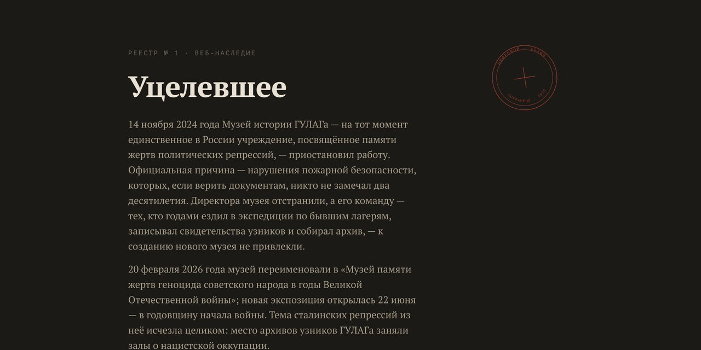

# Реестр сохранённых сайтов

*Registry of preserved websites*

Сайт-каталог всех сохранённых сайтов Музея истории ГУЛАГа и связанных с ним проектов: музейные сайты, выставки, виртуальные туры, персональные архивы и мемориальные инициативы.

**[Открыть реестр →](https://gulagmemory.org)** · [Все репозитории](https://github.com/gulag-museum)

| | |
|:--|:--|
| **Тип** | Реестр сохранённых сайтов |
| **Адрес** | [gulagmemory.org](https://gulagmemory.org) |
| **Создан** | июль 2026 |

## О проекте

После того как в ноябре 2024 года Музей истории ГУЛАГа прекратил работу, его сайты остались без поддержки: домены не продлевались, серверы отключались. Реестр собирает сохранённые копии в одном месте и даёт им постоянные адреса в домене `gulagmemory.org`.

Каждый сайт хранится в отдельном репозитории этого аккаунта как статическая копия и публикуется через GitHub Pages. Домены третьего уровня повторяют исходные адреса: `dnnmuseum.ru` → `dnnmuseum.gulagmemory.org`, `360.gmig.ru` → `360.gmig.gulagmemory.org`.

## Как устроен архив

- **Статические копии.** Сайты на CMS (WordPress, Joomla, 1С-Битрикс) выгружены в HTML; поиск, формы и голосования в копиях не работают.
- **Отдельный репозиторий на каждый сайт** — в README каждого указаны исходный адрес, дата снимка и способ архивации.
- **Новые домены** в `gulagmemory.org` на случай, если исходные будут утрачены.

## Что сейчас в реестре

Музейные сайты и туры 360°, два сайта музея «Дом на набережной», сайты выставок «Комиссар исчезает» и «Троцкий. Комиссар возвращается», мемориальные проекты «30 октября», «Расстрельный дом» и конкурс на Монумент жертвам политических репрессий, веб-архив Юрия Домбровского и архив видеовоспоминаний «Мой ГУЛАГ». Полный список со ссылками — на [gulagmemory.org](https://gulagmemory.org) и в [профиле аккаунта](https://github.com/gulag-museum).

---

Реестр — часть некоммерческого архива цифрового наследия Музея истории ГУЛАГа, созданного в исследовательских и образовательных целях. Права на материалы сохранённых сайтов принадлежат их авторам и правообладателям.

<b>English</b>

### Registry of preserved websites

Catalogue of the preserved websites of the GULAG History Museum and related projects: museum sites, exhibitions, 360° tours, personal archives and memorial initiatives. Each site lives in its own repository as a static copy served via GitHub Pages under the `gulagmemory.org` domain.

**Type:** Registry · **Address:** [gulagmemory.org](https://gulagmemory.org)

Part of a non-commercial digital heritage archive for research and education. All materials of the preserved sites remain the property of their authors and rights holders.

